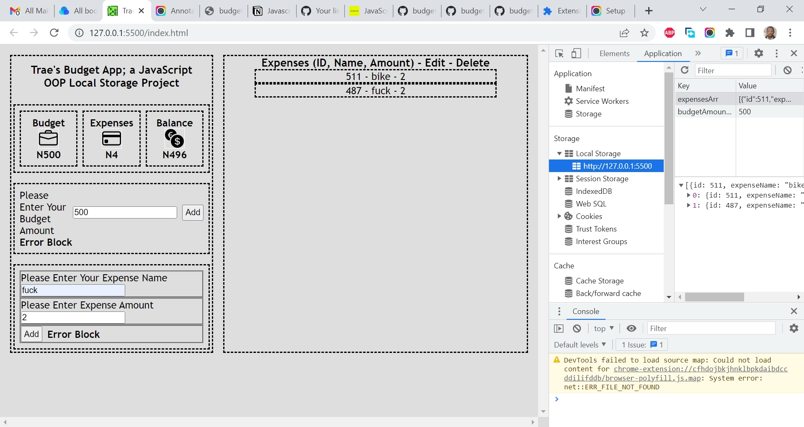

# Section.io - Budgeting App Javascript OOP Local Storage Project on JS Beginners

This is a solution to the [Budgeting App Javascript OOP Local Storage Project on JS Beginners](https://jsbeginners.com/todo-list-javascript-project-v1/). I am trying to improve my coding skills by building realistic projects. 

## Table of contents

- [Overview](#overview)
  - [The challenge](#the-challenge)
  - [Screenshot](#screenshot)
  - [Links](#links)
  - [My process](#my-process)
  - [Built with](#built-with)
  - [What I learned](#what-i-learned)
  - [Continued development](#continued-development)
  - [Useful resources](#useful-resources)
  - [Author](#author)
  - [Acknowledgments](#acknowledgments)

## Overview

### The challenge

The objective of this project is to use JavaScript OOP. It takes a budget and expenses and provides a running balance. 

### Screenshot

### Links

- Solution URL: [https://github.com/traez/todo-list-javascript-oop-project](https://github.com/traez/todo-list-javascript-oop-project)
- Live Site URL: [https://traez.github.io/todo-list-javascript-oop-project/](https://traez.github.io/todo-list-javascript-oop-project/)

## My process

### Built with

- Semantic HTML5 markup
- CSS custom properties
- Flexbox
- CSS Grid
- Mobile-first workflow
- Vanilla JavaScript

### What I learned

Continuously getting familiar with OOP and Local Storage projects.  
Couldn't code all expected features, at this stage would make for overly voluminous work.  
Need to move onto the next project ASAP and make sure I can increasingly code more independently.  

### Continued development

More practice in same [Objects (OOP), Classes and Local storage].    

### Useful resources

Stackoverflow  
MDN Web Docs  
w3schools  
YouTube  
Google  
ChatGPT OpenAI chatbot  

## Author

- Website - [Trae Zeeofor](https://github.com/traez)  
- Twitter - [@trae_z](https://twitter.com/trae_z) 

## Acknowledgments

Practice makes perfect, ChatGPT OpenAI chatbot was immense in helping me practice more efficiently.  
I now anticipate reaching perfection much earlier.  
